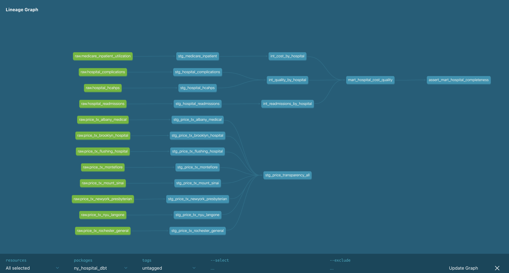

# NY Hospital Cost & Quality Variance

**An end-to-end analytics project: does what a hospital *charges* — or how patients
*rate* it — predict the quality of care? Answered with 3 public datasets, a tested
dbt + BigQuery pipeline, and a weekly self-refreshing automation.**

> ### 🔑 Key finding
> Across **90 New York hospitals**, **patient-satisfaction ratings predict 30-day
> readmission performance (r = −0.52, p < 0.001)** — but **Medicare payment per
> discharge does not (r = −0.06, not significant).**
> **Patient experience, not spending, signals clinical quality.**
> *(Figures from the Sept 2026 automated data refresh; see the live-pipeline note below.)*

**📊 [Live interactive dashboard (Tableau Public)](https://public.tableau.com/app/profile/meet.patel5823/viz/NYHospitalcostquality/Dashboard1)**
 · **📝 [One-page findings memo](docs/findings_memo.md)**
 · **📈 [Refreshable Excel report](excel/NY_Hospital_Cost_Quality.xlsx)**

---

## Why this project

Health plans and systems want to steer patients to hospitals that deliver good
outcomes without overpaying — but that requires knowing which visible signal
(price, patient reviews) actually tracks clinical quality. This project answers
that question with public data, and builds the tested, automated pipeline that
makes the answer reproducible and current.

It was deliberately built on **messy, real-world public data** (not a clean Kaggle
set) to demonstrate the full analyst workflow: sourcing, data-quality diagnosis,
modeling, testing, analysis, visualization, and automation.

## 🛠️ Skills & tools demonstrated

| Area | Tools / techniques |
|---|---|
| **Languages** | SQL, Python (pandas, scipy, requests) |
| **Cloud warehouse** | Google BigQuery |
| **Data modeling** | dbt (staging → intermediate → marts), dbt_utils, 13 data-quality tests |
| **Analytics** | correlation & significance testing, volume-weighting, confound analysis, segmentation |
| **BI / reporting** | Tableau (interactive dashboard w/ actions & filters), Excel + Power Query (refreshable) |
| **Automation / CI** | GitHub Actions (weekly scheduled pipeline) |
| **AI in workflow** | LLM-based test-failure triage (classification only, human-reviewed) |
| **Engineering practice** | Git version control, data-quality documentation, reproducible builds |

## 📷 Pipeline lineage (auto-generated by dbt)



*12 raw sources (green) → cleaned staging models → hospital-level intermediate
models → one analytical mart → tests. dbt builds this dependency graph
automatically from the code.*

## 🏗️ How it works

```
CMS Provider Data API ─┐
CMS Medicare cost CSV ─┼─► Python ingest ─► BigQuery (raw, untouched)
8 hospital price files ┘                          │
                                                  ▼
                              dbt staging  — type, rename, handle
                              suppression; unify 8 incompatible price schemas
                                                  │
                                                  ▼
                              dbt intermediate — aggregate to one row per hospital
                                                  │
                                                  ▼
                              dbt mart (mart_hospital_cost_quality)
                                                  │
             ┌────────────────────────────────────┼─────────────────────────────┐
             ▼                                     ▼                              ▼
      dbt tests (13) +                      Tableau dashboard            Excel + Power Query
      LLM failure triage                    (finding-led)                (refreshable report)
             │
             ▼
      GitHub Actions — weekly: re-ingest → dbt build → test → triage on failure → re-export
```

## 📂 Data sources (all free, public, no registration)

| Source | Provides | Role |
|---|---|---|
| CMS Provider Data Catalog (API) | readmissions, complications, HCAHPS patient surveys | quality |
| CMS Medicare Inpatient Utilization & Payment (CSV) | payment per hospital per procedure (DRG) | cost |
| Hospital price-transparency files (8 NY hospitals) | negotiated insurer rates | pricing (~11.9M rows) |

## 🔍 Data quality — a real deliverable

Most portfolio projects use pre-cleaned data. This one loads data **raw** and
documents **10 real data-quality problems** with evidence in
[`docs/data_quality_findings.md`](docs/data_quality_findings.md), including:

- **Three different hospital-ID schemes** across sources (CCN vs NPI vs EIN) — the core join problem
- **36% of readmission values and 87% of HCAHPS rows are structurally suppressed** by CMS
- **Three incompatible price-file formats** — tall CSV, a 3,700-column wide CSV, and nested JSON — all unified into one schema
- Character-encoding bugs and a UTF-8 BOM that surfaced two steps from its cause

## ✅ Testing, automation & AI

- **13 dbt tests** (`not_null`, `unique`, `accepted_range`, `accepted_values`, plus a custom integrity test) — enforce the data-quality rules on every run.
- **Deliberately introduced and caught a defect** to prove the tests work (in git history + triage log).
- **LLM failure triage** — on a test failure, an LLM classifies the failure type and drafts a plain-English root-cause summary **for human review** ([`docs/llm_triage_log.md`](docs/llm_triage_log.md)); deliberately kept out of any metric computation.
- **Weekly GitHub Actions pipeline** — re-ingests CMS data, rebuilds and tests everything, re-exports the report, all unattended.

## 📈 The analysis (methodology in brief)

- **Cost** = volume-weighted average Medicare payment across a hospital's real case mix.
- **Quality** = risk-adjusted 30-day excess readmission ratio (1.0 = as expected).
- Correlations via `scipy.stats.pearsonr`; robustness checked **within each region** so the finding isn't a geography artifact (it holds in NYC, suburbs, and upstate).
- Full write-up: [`docs/analysis_findings.md`](docs/analysis_findings.md).

**Honest caveat (stated, not hidden):** raw cost differs ~89% between NYC and
upstate hospitals largely due to Medicare's **geographic wage index**, not
efficiency. The high-cost/worse-outcome cluster is concentrated in NYC safety-net
hospitals serving more complex patients — this is **not** evidence they are wasteful.

## 🗂️ Repository map

```
ingest_*.py, load_price_transparency.py    raw data → BigQuery
generate_wide_unpivot_sql.py               code-generates dbt SQL for wide price files
ny_hospital_dbt/                           dbt project (models, 13 tests, profiles, docs)
analysis_cost_quality.py, _robustness.py   the statistical analysis
llm_triage.py                              LLM test-failure triage
export_for_tableau.py                      mart → CSV for BI tools
audit_pipeline.py                          end-to-end pipeline audit
.github/workflows/weekly_refresh.yml       weekly automation
docs/                                      memo, data-quality doc, analysis, lineage graph, triage log
tableau/, excel/                           dashboard workbook + refreshable report
```

## ▶️ Reproduce it

```bash
python -m venv venv && source venv/bin/activate
pip install requests pandas scipy google-cloud-bigquery dbt-core dbt-bigquery anthropic
# set GOOGLE_APPLICATION_CREDENTIALS + GCP_PROJECT_ID (BigQuery service account)
python ingest_cms_api.py && python ingest_medicare_inpatient.py
cd ny_hospital_dbt && dbt deps && dbt build     # builds models + runs 13 tests
```

## ⚠️ Notes & limitations

- **Live pipeline:** figures update weekly as CMS republishes. The headline was
  r = −0.44 at an earlier refresh and r = −0.52 in Sept 2026 — the finding is
  **stable and directional** even as the exact coefficient moves.
- Public CMS data supports a defensible finding, not clinical causation.
- Scoped to 90 NY hospitals with sufficient Medicare volume.
- A portfolio project, not production experience.

---

*Built by Meet Patel. Questions welcome via GitHub issues.*
